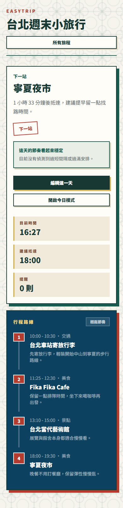
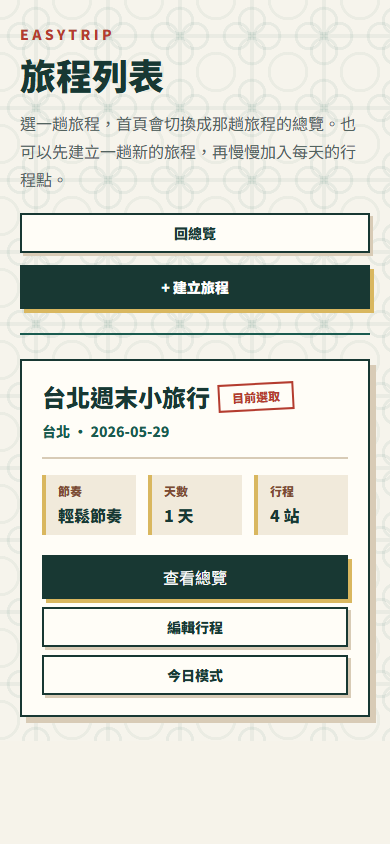
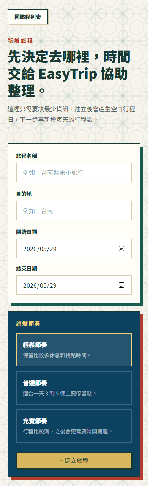
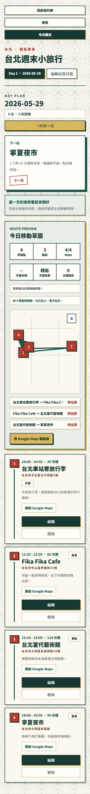
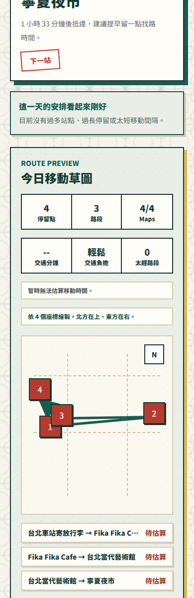
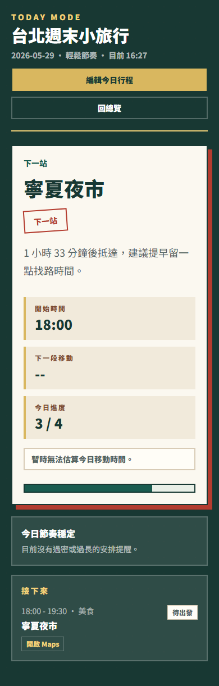

# EasyTrip 最新版手機圖文懶人包

更新日期：2026-05-29

這份是依照目前專案最新版重新整理的社群貼文稿。截圖改用手機版完整長圖，不再裁成首屏，因此每張都能完整呈現頁面內容。

手機截圖素材放在：

`docs/social-assets-mobile/`

主要使用這批完整截圖：

- `01-home-mobile-full.png`
- `02-trips-mobile-full.png`
- `03-create-trip-mobile-full.png`
- `04-day-plan-mobile-full.png`
- `05-today-mode-mobile-full.png`
- `06-route-preview-mobile-full.png`

---

## 01｜封面：EasyTrip 是什麼？

### 圖上標題

EasyTrip

### 圖上副標

為城市小旅行設計的輕量行程助手

### 貼文說明

EasyTrip 是一個 local-first 的旅行規劃 MVP，專注在短天數城市旅行。它不只幫使用者記錄景點，而是把「下一站去哪、今天節奏如何、是否需要調整」這些旅行中最常被反覆確認的資訊整理好。

### 圖上可標註亮點

- 下一站摘要
- 今日時間
- 今日模式入口
- 行程穩定提醒
- 當日時間線預覽

---

## 02｜旅程管理：多趟旅行清楚切換

### 圖上標題

多趟旅程，一眼管理

### 圖上副標

週末小旅行、單日散步、城市短旅都能分開保存

### 貼文說明

旅程列表保留每趟旅行自己的目的地、日期與節奏設定。使用者可以在不同旅程之間切換，首頁也會跟著目前選定的旅程更新，讓資料不會混在一起。

### 圖上可標註亮點

- 已建立旅程列表
- 目前旅程選擇
- 建立新旅程入口
- 本機保存旅程資料

---

## 03｜建立旅程：先開始，不用一次填完

### 圖上標題

先決定去哪，細節慢慢補

### 圖上副標

只填名稱、目的地、日期與旅行節奏

### 貼文說明

EasyTrip 的建立流程刻意很輕。使用者只要先建立旅程框架，系統就會依日期產生每日行程，後續再慢慢加入景點、餐廳、交通或休息點。

### 圖上可標註亮點

- 日期區間驗證
- 輕鬆／一般／緊湊節奏
- 建立後自動產生日行程
- 手機版表單資訊不過載

---

## 04｜每日行程：把一天變成時間線

### 圖上標題

一天的安排，看得出節奏

### 圖上副標

停留點、時間、提醒、路線預覽集中在同一頁

### 貼文說明

每日行程頁會依時間排序所有停留點，並提供下一站摘要、行程提醒、新增與編輯入口。手機版完整長圖可以看到從行程狀態、Route Preview 到每個停留點卡片的完整安排。

### 圖上可標註亮點

- Day Plan 時間線
- 下一站提示
- 行程提醒數
- 手機版新增行程點
- Route Preview
- 每站 Google Maps 入口

---

## 05｜Route Preview：移動也要一起檢查

### 圖上標題

不只排景點，也檢查移動

### 圖上副標

停留點、路段、Google Maps 連動狀態一次看

### 貼文說明

最新版加入 Route Preview，會把一天的停留點整理成移動草圖，並顯示站點數、路段數與 Google Maps 連動數。若地點資料足夠，也能透過 Routes API 預估相鄰停留點之間的步行時間與距離。

### 圖上可標註亮點

- 4 個停留點
- 3 段移動路線
- 4/4 Maps 連動
- 移動草圖
- 開啟 Google Maps 路線

---

## 06｜Google Maps 連動：地點資料更可靠

### 圖上標題

貼上 Google Maps，就能整理地點

### 圖上副標

比只輸入文字地址更不容易跑錯地方

### 貼文說明

EasyTrip 把 Google Maps URL 當作主要地點來源。使用者貼上地圖連結後，系統會嘗試解析地點名稱、地址、座標與 Place ID，並用最可靠的資料來源進行路線估算，降低地點名稱相似造成的誤判。

### 圖上可標註亮點

- Google Maps URL
- 地點預覽
- Place ID / 座標 / 地址
- Google Maps 導航入口
- 短連結解析

---

## 07｜Today Mode：旅行當下只看下一步

### 圖上標題

旅行當天，只聚焦下一步

### 圖上副標

今日模式會把下一站、移動提醒、進度整理成一個專注畫面

### 貼文說明

Today Mode 是為旅行當下設計的模式。這次已使用日期為 `2026-05-29` 的台北行程截圖，因此畫面呈現完整今日模式：下一站是「寧夏夜市」，目前進度為 `3 / 4`，並提醒使用者距離下一站還有多久。

### 圖上可標註亮點

- 今日日期：2026-05-29
- 下一站：寧夏夜市
- 開始時間：18:00
- 今日進度：3 / 4
- 接下來行程清單
- 開啟 Maps

---

## 08｜設計巧思：安靜，但有方向感

### 圖上標題

安靜的介面，清楚的提醒

### 圖上副標

不把旅行規劃做得很吵，而是把下一步說清楚

### 貼文說明

EasyTrip 的視覺語言使用台灣感的深綠、米白、金色與紅色。整體介面保持安靜、可掃描，只有在需要行動或提醒時才提高視覺權重。這讓它不像沉重的規劃工具，更像一個陪你走到下一站的旅行助手。

### 圖上可標註亮點

- 台灣感視覺語言
- 深綠主色
- 金色 CTA
- 紅色狀態提示
- mobile-first 排版

---

## 社群 Caption

EasyTrip 是一個為城市小旅行設計的輕量行程規劃工具。

最新版把「規劃前」和「旅行中」都一起考慮進來：可以建立旅程、安排每日停留點、貼上 Google Maps 連結整理地點、預覽路線移動，也能在 Today Mode 聚焦旅行當下最重要的下一步。

這次手機版圖文懶人包改用完整長圖截圖，讓首頁、旅程列表、建立旅程、每日行程、Route Preview 與 Today Mode 都能完整呈現，不會被首屏裁切。

我希望 EasyTrip 不是一個很重的旅遊管理系統，而是一個安靜的旅行助手：幫你把下一站、移動時間、行程節奏與可能過緊的安排整理好，讓你可以更安心地享受旅程本身。

目前功能包含：

- 多旅程管理
- 每日行程時間線
- Google Maps URL 地點解析
- Route Preview 移動預覽
- Routes API 步行時間與距離估算
- Today Mode 當日旅行模式
- 手機版底部編輯體驗
- localStorage 本機保存
- RWD 手機、平板、桌機支援

Live Demo:
https://easy-trip-chi.vercel.app/

---

## 建議輪播順序

1. EasyTrip 是什麼
2. 多旅程管理
3. 建立旅程
4. 每日行程時間線
5. Route Preview
6. Google Maps 連動
7. Today Mode
8. 設計巧思與總結

---

## Hashtags

#EasyTrip
#TravelPlanner
#旅遊規劃
#行程規劃
#SideProject
#FrontendDevelopment
#Nextjs
#React
#TypeScript
#GoogleMaps
#PortfolioProject

