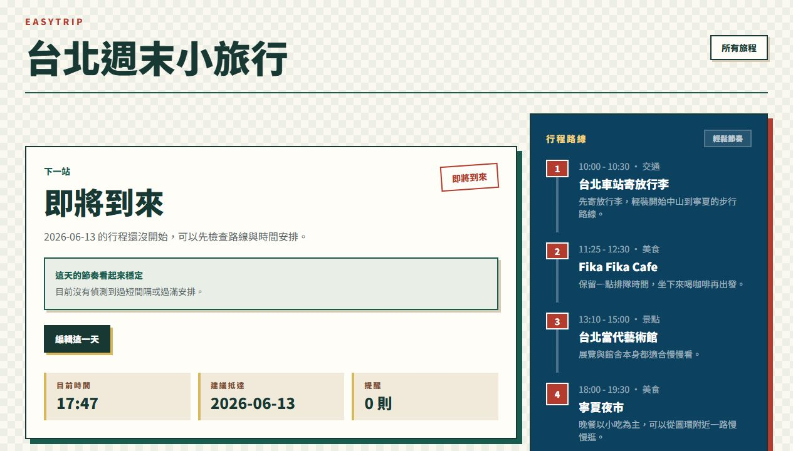
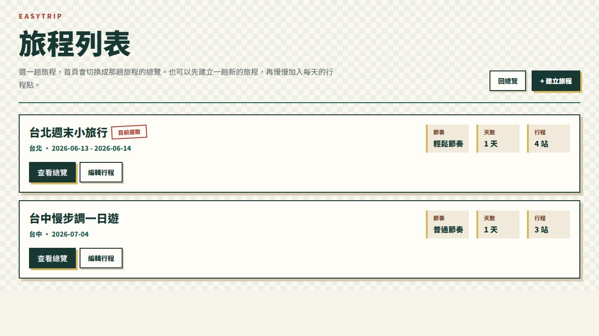
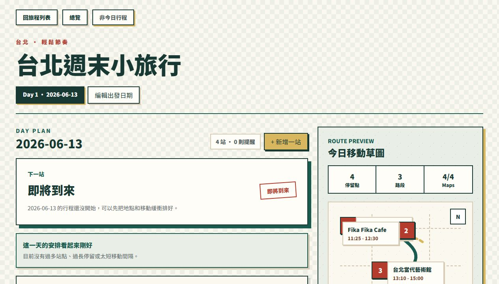

# EasyTrip 圖文懶人包

這份檔案是社群貼文用的「截圖 + 說明」版本。可以直接照順序做成 IG 輪播、Threads 長圖、Facebook 圖文貼文，或貼進作品集文章。

截圖素材放在：

`docs/social-assets/`

---

## 01｜封面：城市小旅行的輕量助手

### 圖上主標

EasyTrip

### 圖上副標

讓城市小旅行從排行程到移動都更安心

### 截圖說明

首頁會把目前選定的旅程、下一站狀態、今日時間與行程提醒集中呈現。使用者一打開就能知道現在最需要注意什麼，不用先進入複雜的行程列表。

### 可以標註的亮點

- 下一站摘要
- 行程狀態提醒
- 當前時間與提醒數
- 台灣感配色與卡片式資訊層級

---

## 02｜旅程列表：所有旅程一眼切換

### 圖上主標

多趟旅程，清楚管理

### 圖上副標

從週末小旅行到單日散步，都可以快速切換

### 截圖說明

旅程列表讓使用者管理不同城市、不同日期的旅行計畫。首頁會跟著目前選取的旅程切換，適合保存多趟短旅行或不同版本的行程。

### 可以標註的亮點

- 多旅程管理
- 回到總覽入口
- 建立新旅程 CTA
- 每趟旅程保留自己的日期與節奏設定

---

## 03｜建立旅程：先填最少資訊

### 圖上主標

先決定去哪裡，細節慢慢補

### 圖上副標

只需要旅程名稱、目的地、日期與旅行節奏

### 截圖說明

建立旅程時不要求一次填完所有景點，只先建立旅行框架。這樣能降低開始規劃的壓力，使用者可以先把大方向存起來，再逐步加入每天的停留點。

### 可以標註的亮點

- 日期區間驗證
- 旅行節奏選擇
- 建立後自動產生日行程
- 表單資訊量控制得很輕

---

## 04｜每日行程：把一天排成時間線

### 圖上主標

一天的安排，看起來就該有節奏

### 圖上副標

時間、停留長度、地點類型與備註集中在同一條時間線

### 截圖說明

每日行程頁把景點、餐廳、交通與休息點依時間排序，讓行程不只是清單，而是一條可以閱讀的旅行時間線。每個停留點都有類別、時間、備註與 Google Maps 入口。

### 可以標註的亮點

- Day Plan 時間線
- 景點類型標籤
- 停留時間
- Google Maps 入口
- 新增與編輯行程點

---

## 05｜路線預覽：知道下一段移動長什麼樣

### 圖上主標

不只排景點，也檢查移動

### 圖上副標

Route Preview 把停留點、路段與 Google Maps 連動狀態視覺化

### 截圖說明

右側 Route Preview 會把一天中的停留點整理成移動草圖，並顯示站點數、路段數與 Google Maps 連動數。當地點資料完整時，系統也能估算相鄰景點之間的步行時間與距離。

### 可以標註的亮點

- 停留點數
- 路段數
- Maps 連動狀態
- 一鍵開啟 Google Maps 路線
- 移動時間與距離估算

---

## 06｜Today Mode：只看旅行當下最重要的事

### 圖上主標

旅行當下，只聚焦下一步

### 圖上副標

Today Mode 會依日期判斷今天是否有對應行程

### 截圖說明

Today Mode 是為「實際旅行當天」設計的模式。當今天有對應行程時，它會聚焦下一站、移動時間與完成進度；如果不是旅行日期，也會清楚告訴使用者今天沒有這趟旅程，避免誤判。

### 可以標註的亮點

- 今日日期判斷
- 下一站焦點
- 行程進度
- 移動時間提醒
- 非旅行日狀態清楚回饋

---

## 07｜設計巧思：安靜但有提醒感

### 圖上主標

介面安靜，但提醒不缺席

### 圖上副標

行程太滿、時間太長、轉場太緊時，系統會主動提示

### 截圖說明

EasyTrip 的視覺語言刻意保持清楚、克制，讓使用者可以快速掃描資訊。提醒卡片、紅色標記與金色 CTA 則用在需要注意或行動的地方，讓視覺重點不會被裝飾淹沒。

### 可以標註的亮點

- 台灣感配色
- 深綠主視覺
- 金色行動按鈕
- 紅色狀態提示
- 手機與桌機都能使用的版面

---

## 08｜總結：從規劃走到下一站

### 圖上主標

EasyTrip 讓行程規劃一路走到下一站

### 圖上副標

不只是收藏景點，而是把旅途中會焦慮的資訊整理好

### 截圖說明

EasyTrip 的產品重點不是做一個更複雜的旅遊工具，而是讓短途城市旅行更容易開始、更容易調整，也更容易在旅途中知道下一步。

### 結尾文案

EasyTrip 想做的是一個安靜的旅行助手：不搶走旅程本身的風景，只在你需要方向時，把下一步說清楚。

Live Demo:
https://easy-trip-chi.vercel.app/

---

## 建議輪播排序

1. 封面：EasyTrip 是什麼
2. 痛點：旅行最累的是一直確認下一步
3. 建立旅程：先填最少資訊
4. 每日行程：時間線與停留點
5. Google Maps：地點與路線連動
6. Route Preview：移動視覺化
7. Today Mode：旅行當下聚焦下一站
8. 總結：安靜的旅行助手 + Live Demo

---

## 可直接貼的短版 Caption

EasyTrip 是一個為城市小旅行設計的輕量行程規劃工具。

它不只幫你把景點排進清單，也會整理旅行當下最需要知道的資訊：下一站、移動時間、今日進度，以及行程是否排得太緊。

這次我把專案整理成圖文懶人包，從首頁總覽、建立旅程、每日時間線、Route Preview 到 Today Mode，展示它如何把旅行中那些細碎但真實的焦慮變得清楚。

Live Demo:
https://easy-trip-chi.vercel.app/

